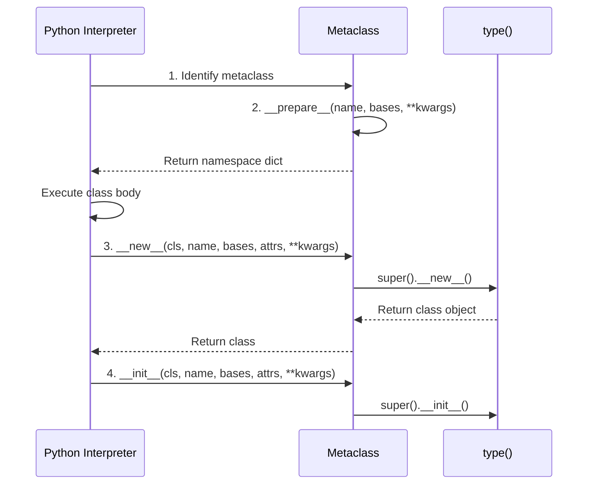
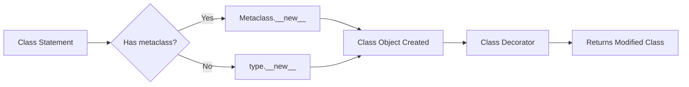

# \# ROLE

You are a Python Core Internals Expert and Technical Author.

# TASK

Create a complete Markdown guide on:

Metaclasses

# OUTPUT

Generate ONLY Markdown.

Start with:

# Python Advanced Object Model — Part 2

Include TOC.

## Foundations

Cover:

- What metaclasses are
- Classes as objects
- type class
- Instance → Class → Metaclass hierarchy


## Class Creation Process

Cover:

- __prepare__
- __new__
- __init__
- Class creation lifecycle
- Namespace preparation


## Custom Metaclasses

Build examples for:

- Validation metaclass
- Registry metaclass
- Singleton metaclass
- Plugin metaclass


## Dynamic Class Creation

Cover:

- type()
- Runtime class generation
- Method injection


## Real-World Usage

Explain usage in:

- Django
- SQLAlchemy
- Pydantic


## Comparison

Metaclasses vs:

- Decorators
- Class decorators
- __init_subclass__
- Descriptors

Include:

- Internal execution flow
- Diagrams
- Code examples
- Best practices
- Common mistakes

End with:

- Summary
- Cheat Sheet
- Interview Questions
- Exercises

I'll create a comprehensive Markdown guide on Python metaclasses now with all the requested sections, examples, diagrams, and best practices.

# Python Advanced Object Model — Part 2

## Table of Contents

- [1. Foundations](#1-foundations)
    - [1.1 What Metaclasses Are](#11-what-metaclasses-are)
    - [1.2 Classes as Objects](#12-classes-as-objects)
    - [1.3 The `type` Class](#13-the-type-class)
    - [1.4 Instance → Class → Metaclass Hierarchy](#14-instance-class-metaclass-hierarchy)
- [2. Class Creation Process](#2-class-creation-process)
    - [2.1 `__prepare__`](#21-prepare)
    - [2.2 `__new__`](#22-new)
    - [2.3 `__init__`](#23-init)
    - [2.4 Class Creation Lifecycle](#24-class-creation-lifecycle)
    - [2.5 Namespace Preparation](#25-namespace-preparation)
- [3. Custom Metaclasses](#3-custom-metaclasses)
    - [3.1 Validation Metaclass](#31-validation-metaclass)
    - [3.2 Registry Metaclass](#32-registry-metaclass)
    - [3.3 Singleton Metaclass](#33-singleton-metaclass)
    - [3.4 Plugin Metaclass](#34-plugin-metaclass)
- [4. Dynamic Class Creation](#4-dynamic-class-creation)
    - [4.1 `type()` Function](#41-type-function)
    - [4.2 Runtime Class Generation](#42-runtime-class-generation)
    - [4.3 Method Injection](#43-method-injection)
- [5. Real-World Usage](#5-real-world-usage)
    - [5.1 Django](#51-django)
    - [5.2 SQLAlchemy](#52-sqlalchemy)
    - [5.3 Pydantic](#53-pydantic)
- [6. Comparison](#6-comparison)
    - [6.1 Metaclasses vs Decorators](#61-metaclasses-vs-decorators)
    - [6.2 Metaclasses vs Class Decorators](#62-metaclasses-vs-class-decorators)
    - [6.3 Metaclasses vs `__init_subclass__`](#63-metaclasses-vs-init_subclass)
    - [6.4 Metaclasses vs Descriptors](#64-metaclasses-vs-descriptors)
- [7. Internal Execution Flow](#7-internal-execution-flow)
- [8. Best Practices](#8-best-practices)
- [9. Common Mistakes](#9-common-mistakes)
- [10. Summary](#10-summary)
- [11. Cheat Sheet](#11-cheat-sheet)
- [12. Interview Questions](#12-interview-questions)
- [13. Exercises](#13-exercises)

***

## 1. Foundations

### 1.1 What Metaclasses Are

A **metaclass** is the "class of a class" — just as a class defines how an object behaves, a metaclass defines how a class behaves. In Python:

- **Objects** are instances of **classes**
- **Classes** are instances of **metaclasses**
- The default metaclass is [`type`](https://docs.python.org/3/library/functions.html#type)[^1_1][^1_2]

```python
class MyClass:
    pass

obj = MyClass()
print(type(obj))        # <class '__main__.MyClass'>
print(type(MyClass))    # <class 'type'> ← MyClass is an instance of type
```

Metaclasses let you run logic **when the class is created**, not when it runs — enabling validation, auto-registration, and boilerplate reduction.[^1_3][^1_4]

### 1.2 Classes as Objects

In Python, **everything is an object**, including classes:

```python
class TestClass:
    pass

my_test_class = TestClass()
print(my_test_class)    # <__main__.TestClass object at 0x...>
print(type(TestClass))  # <class 'type'> ← Class is an object
```

Classes can be created dynamically, passed as arguments, stored in variables, and have attributes — all characteristics of objects.[^1_5][^1_1]

### 1.3 The `type` Class

The `type` class serves dual purposes:


| Purpose | Description |
| :-- | :-- |
| Type introspection | `type(obj)` returns the object's class |
| Class factory | `type(name, bases, dict)` creates classes dynamically [^1_1][^1_5] |

```python
# Introspection
type("hello")        # str
type(42)             # int
type(MyClass)        # type

# Creating classes dynamically
DynamicClass = type('DynamicClass', (), {'attr': 'value'})
print(DynamicClass.attr)  # value
```

Interestingly, `type` itself is an instance of `type`:

```python
type(type)    # <class 'type'> ← type is an instance of itself
```


### 1.4 Instance → Class → Metaclass Hierarchy

```
┌─────────────────────────────────────────────────┐
│  Metaclass (e.g., type, CustomMeta)            │
│  ───────────────────────────────────────────    │
│  Defines how classes behave                     │
│  Methods: __prepare__, __new__, __init__, __call__ │
└───────────────────┬─────────────────────────────┘
                    │ instance of
                    ▼
┌─────────────────────────────────────────────────┐
│  Class (e.g., MyClass, Django Model)           │
│  ───────────────────────────────────────────    │
│  Defines how objects behave                     │
│  Methods: __init__, methods, attributes         │
└───────────────────┬─────────────────────────────┘
                    │ instance of
                    ▼
┌─────────────────────────────────────────────────┐
│  Instance (e.g., obj = MyClass())              │
│  ───────────────────────────────────────────    │
│  Runtime object with state                      │
└─────────────────────────────────────────────────┘
```

**Verification:**

```python
class Meta(type):
    pass

class MyClass(metaclass=Meta):
    pass

obj = MyClass()

print(type(obj))      # <class '__main__.MyClass'>     ← obj is instance of MyClass
print(type(MyClass))  # <class '__main__.Meta'>        ← MyClass is instance of Meta
print(type(Meta))     # <class 'type'>                 ← Meta is instance of type
```

Subclasses automatically inherit the metaclass:[^1_1][^1_5]

```python
class MySubclass(MyClass):
    pass

print(type(MySubclass))  # <class '__main__.Meta'> ← inherits Meta
```


***

## 2. Class Creation Process

### 2.1 `__prepare__`

**Purpose:** Called **before** the class body is executed. Returns a dictionary-like object used as the local namespace for class attributes.[^1_6][^1_1]

```python
class MetaWithPrepare(type):
    @classmethod
    def __prepare__(mcs, name, bases, **kwargs):
        print(f'__prepare__: {name}, kwargs={kwargs}')
        return {}  # Must return dict-like object

class MyClass(metaclass=MetaWithPrepare, extra=1):
    a = 1
    b = 2
```

**Output:**

```
__prepare__: MyClass, kwargs={'extra': 1}
```

**Key points:**

- Called before class body execution
- Must return dict-like object
- Receives keyword arguments from class definition[^1_6][^1_1]


### 2.2 `__new__`

**Purpose:** The **constructor** that creates and returns the class object. Called after `__prepare__`.[^1_7][^1_1]

```python
class MetaWithNew(type):
    def __new__(mcs, name, bases, attrs, **kwargs):
        print(f'__new__: {name}, attrs={list(attrs.keys())}')
        # Add default attribute
        attrs['default_attr'] = 'added'
        return super().__new__(mcs, name, bases, attrs)

class MyClass(metaclass=MetaWithNew):
    existing = 'value'

print(MyClass.default_attr)  # 'added' ← added by metaclass
```

**Signature:** `__new__(cls, name, bases, attrs, **kwargs)`

**Key points:**

- Returns the class object
- Can modify `attrs` before class creation
- Called only **once** per class lifetime[^1_7][^1_1]


### 2.3 `__init__`

**Purpose:** Initializes the class **after** it has been created. Called after `__new__` returns.[^1_1][^1_7]

```python
class MetaWithInit(type):
    def __init__(cls, name, bases, attrs, **kwargs):
        print(f'__init__: {name}')
        super().__init__(name, bases, attrs)
        # Class is fully created here
        cls.initialized = True

class MyClass(metaclass=MetaWithInit):
    pass

print(MyClass.initialized)  # True
```

**Key points:**

- Called after class is constructed
- Not an instance method — it's a class method
- Called only **once** during class lifetime[^1_7][^1_1]
- Uncommon to implement because class is already built


### 2.4 Class Creation Lifecycle



**Execution order:**

1. **Identify metaclass** (from `metaclass=` keyword or base classes)
2. **`__prepare__`** → Returns namespace dict
3. **Execute class body** → Populates namespace
4. **`__new__`** → Creates class object from namespace
5. **`__init__`** → Initializes class after creation
6. **Class is ready** → Available for use[^1_6][^1_1][^1_7]

### 2.5 Namespace Preparation

```python
class OrderedNamespaceMeta(type):
    @classmethod
    def __prepare__(mcs, name, bases):
        from collections import OrderedDict
        print(f'Creating ordered namespace for {name}')
        return OrderedDict()

class OrderedClass(metaclass=OrderedNamespaceMeta):
    z = 3
    a = 1
    m = 10

# Attributes maintain insertion order
print(list(OrderedClass.__dict__.keys()))
```

**When `__prepare__` is absent:**

```python
class SimpleMeta(type):
    # No __prepare__ → uses empty dict
    pass

class SimpleClass(metaclass=SimpleMeta):
    pass
# Namespace initialized as empty ordered mapping (dict)
```


***

## 3. Custom Metaclasses

### 3.1 Validation Metaclass

Ensures all classes follow specific rules (e.g., must have certain methods or attributes).

```python
class ValidationMeta(type):
    def __new__(mcs, name, bases, attrs, **kwargs):
        # Validation: enforce __validate__ method
        if ' __validate__' not in attrs and not any(
            '__validate__' in base.__dict__ for base in bases
        ):
            raise TypeError(f'{name} must implement __validate__ method')
        
        # Validation: enforce required attribute
        if 'required_attr' not in attrs:
            attrs['required_attr'] = None  # Set default
            print(f'  ⚠ {name}: added default required_attr')
        
        return super().__new__(mcs, name, bases, attrs)

# ✅ Valid class
class ValidModel(metaclass=ValidationMeta):
    required_attr = 'set'
    def __validate__(self):
        return True

# ❌ Invalid class (raises TypeError)
# class InvalidModel(metaclass=ValidationMeta):
#     pass  # TypeError: InvalidModel must implement __validate__ method

print(ValidModel.required_attr)  # 'set'
```

**Use cases:**

- ORM models requiring field validation
- Plugin systems enforcing interface contracts
- API models requiring specific methods[^1_4][^1_2]


### 3.2 Registry Metaclass

Automatically tracks all class definitions in a central registry.

```python
class RegistryMeta(type):
    registry = {}
    
    def __new__(mcs, name, bases, attrs, **kwargs):
        cls = super().__new__(mcs, name, bases, attrs)
        RegistryMeta.registry[name] = cls
        print(f'  📦 Registered: {name}')
        return cls

class Plugin(metaclass=RegistryMeta):
    pass

class EmailPlugin(Plugin):
    pass

class SMTPPlugin(Plugin):
    pass

print(RegistryMeta.registry)
# {'Plugin': <class 'Plugin'>, 'EmailPlugin': <class 'EmailPlugin'>, 
#  'SMTPPlugin': <class 'SMTPPlugin'>}

# Retrieve class by name
plugin_class = RegistryMeta.registry['EmailPlugin']
print(plugin_class)  # <class 'EmailPlugin'>
```

**Use cases:**

- Auto-discovery of plugins
- ORM model registration
- Command handler registries[^1_8][^1_4]


### 3.3 Singleton Metaclass

Restricts instantiation to exactly one object using `__call__`.

```python
class SingletonMeta(type):
    _instances = {}
    
    def __call__(cls, *args, **kwargs):
        if cls not in cls._instances:
            print(f'  🆕 Creating singleton instance of {cls.__name__}')
            cls._instances[cls] = super().__call__(*args, **kwargs)
        else:
            print(f'  ♻️  Returning existing singleton of {cls.__name__}')
        return cls._instances[cls]

class DatabaseConnection(metaclass=SingletonMeta):
    def __init__(self, host='localhost'):
        self.host = host
        print(f'  Connected to {host}')

# First instantiation
db1 = DatabaseConnection('prod-server')
# Second instantiation (returns same instance)
db2 = DatabaseConnection('backup-server')

print(db1 is db2)  # True ← same instance
print(db1.host)    # 'prod-server' ← __init__ only ran once
```

**Key insight:** `__call__` intercepts class instantiation (`ClassName()`), not class creation.[^1_8][^1_4]

### 3.4 Plugin Metaclass

Combines registry + validation for plugin systems.

```python
class PluginMeta(type):
    registry = {}
    
    def __new__(mcs, name, bases, dct):
        if name not in cls.registry if hasattr(mcs, 'registry') else {}:
            # Validate plugin interface
            required_methods = ['execute', 'name']
            for method in required_methods:
                if method not in dct:
                    raise TypeError(f'{name} must implement {method}()')
            
            cls = super().__new__(mcs, name, bases, dct)
            mcs.registry[name] = cls
            print(f'  📦 Plugin registered: {name}')
            return cls
        return mcs.registry[name]

class Plugin(metaclass=PluginMeta):
    pass

class EmailPlugin(Plugin):
    def name(self):
        return 'email'
    def execute(self, data):
        return f'Sent email: {data}'

class SMSPlugin(Plugin):
    def name(self):
        return 'sms'
    def execute(self, data):
        return f'Sent SMS: {data}'

# Execute all plugins
for plugin_name, plugin_cls in PluginMeta.registry.items():
    if plugin_name != 'Plugin':  # Skip base class
        plugin = plugin_cls()
        print(f'{plugin.name()}: {plugin.execute("test data")}')
```

**Output:**

```
  📦 Plugin registered: EmailPlugin
  📦 Plugin registered: SMSPlugin
email: Sent email: test data
sms: Sent SMS: test data
```


***

## 4. Dynamic Class Creation

### 4.1 `type()` Function

The `type()` function creates classes dynamically:

```python
# type(name, bases, dict)
DynamicClass = type('DynamicClass', (object,), {
    '__init__': lambda self, value: self.value = value,
    'get_value': lambda self: self.value,
    'static_attr': 'constant'
})

obj = DynamicClass(42)
print(obj.get_value())      # 42
print(DynamicClass.static_attr)  # 'constant'
```

**Syntax:**

```python
MyClass = type(
    'MyClass',           # class name (string)
    (Base1, Base2),      # base classes (tuple)
    {'attr': value,      # class dictionary
     'method': func}
)
```


### 4.2 Runtime Class Generation

```python
def create_model_class(model_name, fields):
    """Dynamically create a model class with validation"""
    
    def __init__(self, **kwargs):
        for field, value in kwargs.items():
            if field not in fields:
                raise ValueError(f'Unknown field: {field}')
            setattr(self, field, value)
    
    def __repr__(self):
        attrs = ', '.join(f'{k}={v}' for k, v in self.__dict__.items())
        return f'{model_name}({attrs})'
    
    return type(
        model_name,
        (object,),
        {
            '__init__': __init__,
            '__repr__': __repr__,
            '__fields__': fields
        }
    )

# Create classes at runtime
User = create_model_class('User', ['name', 'email', 'age'])
Product = create_model_class('Product', ['name', 'price', 'sku'])

user = User(name='Alice', email='alice@example.com', age=30)
print(user)  # User(name=Alice, email=alice@example.com, age=30)
```

**Use cases:**

- ORM schema generation from database
- API response models from JSON
- Dynamic form builders[^1_9][^1_10]


### 4.3 Method Injection

Add methods to classes dynamically during creation:

```python
def log_method_call(method_name):
    def wrapper(self, *args, **kwargs):
        print(f'  📝 Calling {method_name}')
        return method(self, *args, **kwargs)
    return wrapper

class MethodInjectionMeta(type):
    def __new__(mcs, name, bases, attrs, **kwargs):
        # Inject logging into all methods
        for attr_name, attr_value in attrs.items():
            if callable(attr_value) and not attr_name.startswith('_'):
                attrs[attr_name] = log_method_call(attr_name)(attr_value)
        return super().__new__(mcs, name, bases, attrs, **kwargs)

class Service(metaclass=MethodInjectionMeta):
    def process(self, data):
        return f'Processed: {data}'
    
    def validate(self, data):
        return True

service = Service()
service.process('test')  # 📝 Calling process → Processed: test
service.validate('test') # 📝 Calling validate → True
```

**Advanced: Mixin injection**

```python
def add_mixins(base_class, *mixins):
    """Dynamically add mixin methods to a class"""
    mixin_methods = {}
    for mixin in mixins:
        for attr in dir(mixin):
            if not attr.startswith('_') and callable(getattr(mixin, attr)):
                mixin_methods[attr] = getattr(mixin, attr)
    
    return type(
        f'{base_class.__name__}WithMixins',
        (base_class, ) + mixins,
        mixin_methods
    )

class LoggingMixin:
    def log(self, msg):
        print(f'  LOG: {msg}')

class ValidationMixin:
    def validate(self):
        return True

class MyClass(add_mixins(object, LoggingMixin, ValidationMixin)):
    pass

obj = MyClass()
obj.log('test')   # LOG: test
obj.validate()    # True
```


***

## 5. Real-World Usage

### 5.1 Django

Django's ORM uses `ModelBase` metaclass (`django.db.models.base.ModelBase`).[^1_11][^1_12][^1_3]

**What ModelBase does:**

```python
# Simplified Django ModelBase behavior
class ModelBase(type):
    def __new__(mcs, name, bases, attrs, **kwargs):
        # 1. Collect all field definitions
        fields = {
            k: v for k, v in attrs.items() 
            if isinstance(v, (CharField, IntegerField, ForeignKey))
        }
        
        # 2. Process Meta class options
        meta_options = attrs.get('Meta')
        
        # 3. Convert attributes to descriptors
        for field_name, field in fields.items():
            attrs[field_name] = field
        
        # 4. Register model in app registry
        # 5. Validate app name uniqueness
        
        cls = super().__new__(mcs, name, bases, attrs, **kwargs)
        
        # 6. Initialize fields on class
        cls._fields = fields
        cls._meta = meta_options
        
        return cls

class Model(metaclass=ModelBase):
    pass

class User(Model):
    name = CharField()
    age = IntegerField()
    
    class Meta:
        abstract = False

# At import time (not instance creation):
# - Fields collected
# - Model registered
# - Descriptors created
# - ORM ready for .save(), .objects.all()
```

**Key behaviors:**

- Magic happens at **import time** when class is defined[^1_13]
- Collects fields from class attributes
- Converts attributes to descriptors for ORM access
- Registers model in app registry[^1_12][^1_11]


### 5.2 SQLAlchemy

SQLAlchemy uses `DeclarativeMeta` for declarative ORM mapping.[^1_14][^1_15][^1_3]

```python
# SQLAlchemy's DeclarativeMeta (simplified)
from sqlalchemy.ext.declarative import DeclarativeMeta

class Base(metaclass=DeclarativeMeta):
    __abstract__ = True
    
    def __init__(self, **kwargs):
        for key, value in kwargs.items():
            setattr(self, key, value)

# Metaclass automatically:
# 1. Collects Column definitions
# 2. Creates table mapping
# 3. Adds __mapper__ attribute
# 4. Registers in metadata

class User(Base):
    __tablename__ = 'users'
    
    id = Column(Integer, primary_key=True)
    name = Column(String)
    email = Column(String)

# After class definition:
print(User.__tablename__)    # 'users'
print(User.__mapper__)       # Mapper object
print(User.__table__)        # Table object
```

**What happens:**

- `DeclarativeMeta.__new__` processes `Column` attributes
- Creates `__table__` and `__mapper__` automatically
- No boilerplate for table definition[^1_15][^1_14]


### 5.3 Pydantic

Pydantic's `ModelMetaclass` analyzes class body for validation schema.[^1_16][^1_17][^1_3]

```python
from pydantic import BaseModel, Field

# ModelMetaclass does this at class definition:
class ModelMetaclass(type):
    def __new__(mcs, name, bases, attrs, **kwargs):
        # 1. Collect type annotations
        annotations = attrs.get('__annotations__', {})
        
        # 2. Collect Field definitions
        fields = {}
        for attr_name, attr_value in attrs.items():
            if isinstance(attr_value, FieldInfo):
                fields[attr_name] = attr_value
        
        # 3. Build core schema (pydantic-core)
        core_schema = build_schema(annotations, fields)
        
        # 4. Create SchemaValidator and SchemaSerializer
        attrs['__pydantic_validator__'] = SchemaValidator(core_schema)
        attrs['__pydantic_serializer__'] = SchemaSerializer(core_schema)
        
        # 5. Set model_fields attribute
        attrs['model_fields'] = fields
        
        return super().__new__(mcs, name, bases, attrs, **kwargs)

class User(BaseModel):
    name: str
    age: int = Field(gt=0)
    email: str

# At class definition (not instance creation):
print(User.model_fields)  
# {'name': FieldInfo(...), 'age': FieldInfo(...), 'email': FieldInfo(...)}

# Validation happens at runtime:
user = User(name='Alice', age=30, email='alice@example.com')
# Validation already compiled during class definition!
```

**Performance benefit:**

- Schema compilation at **class definition time**
- Validation at runtime uses pre-compiled schema
- Fast validation because validation logic is pre-built[^1_17][^1_18][^1_16]

***

## 6. Comparison

### 6.1 Metaclasses vs Decorators

| Aspect | Metaclasses | Decorators |
| :-- | :-- | :-- |
| **When** | Class creation time | After class is created |
| **Scope** | Class + all subclasses | Single class only |
| **Inheritance** | Propagates automatically | Must re-apply manually |
| **Namespace** | Can inject before body runs (`__prepare__`) | Cannot access namespace during creation |
| **Complexity** | Higher (deep magic) | Lower (simpler) |
| **Use case** | Framework-level control | Post-creation modification |

```python
# Decorator (runs AFTER class creation)
def add_method(cls):
    cls.added_method = lambda self: 'added'
    return cls

@add_method
class MyClass:
    pass

# ❌ Subclass doesn't get added_method
class MySubclass(MyClass):
    pass

print(MySubclass().added_method)  # AttributeError
```

```python
# Metaclass (runs DURING class creation)
class AddMethodMeta(type):
    def __new__(mcs, name, bases, attrs):
        attrs['added_method'] = lambda self: 'added'
        return super().__new__(mcs, name, bases, attrs)

class MyClass(metaclass=AddMethodMeta):
    pass

# ✅ Subclass inherits added_method
class MySubclass(MyClass):
    pass

print(MySubclass().added_method())  # 'added'
```


### 6.2 Metaclasses vs Class Decorators



**Key difference:**

- **Metaclass**: Controls class creation, propagates to subclasses
- **Class decorator**: Wraps class after creation, doesn't propagate

```python
# Class decorator
def class_decorator(cls):
    cls.decorated = True
    return cls

@class_decorator
class Base:
    pass

class Child(Base):
    pass

print(Child.decorated)  # ❌ AttributeError (doesn't propagate)
```

```python
# Metaclass
class DecoratorMeta(type):
    def __new__(mcs, name, bases, attrs):
        attrs['decorated'] = True
        return super().__new__(mcs, name, bases, attrs)

class Base(metaclass=DecoratorMeta):
    pass

class Child(Base):
    pass

print(Child.decorated)  # ✅ True (propagates)
```

**Recommendation:** Prefer class decorators unless you need subclass propagation.[^1_19][^1_20]

### 6.3 Metaclasses vs `__init_subclass__`

```python
# __init_subclass__ (called on subclass creation)
class Base:
    def __init_subclass__(cls, **kwargs):
        print(f'Subclass created: {cls.__name__}')
        super().__init_subclass__(**kwargs)

class Child1(Base):
    pass

class Child2(Base):
    pass
```

**Output:**

```
Subclass created: Child1
Subclass created: Child2
```

| Aspect | `__init_subclass__` | Metaclass |
| :-- | :-- | :-- |
| **When** | On subclass creation | On class creation |
| **Complexity** | Lower | Higher |
| **Control** | Limited (post-creation) | Full (during creation) |
| **Namespace** | Cannot modify namespace | Can modify namespace |
| **Use case** | Simple subclass registration | Complex class transformation |

```python
# __init_subclass__ for registration
class Registry:
    classes = {}

class RegisteredBase:
    def __init_subclass__(cls, **kwargs):
        Registry.classes[cls.__name__] = cls
        super().__init_subclass__(**kwargs)

class MyClass(RegisteredBase):
    pass

print(Registry.classes)  # {'MyClass': <class 'MyClass'>}
```

**When to use:**

- `__init_subclass__`: Simple registration, validation on subclass
- Metaclass: Need to modify class namespace, inject methods, complex transformations[^1_19]


### 6.4 Metaclasses vs Descriptors

| Aspect | Metaclasses | Descriptors |
| :-- | :-- | :-- |
| **Level** | Class-level (class of class) | Attribute-level (inside class) |
| **Purpose** | Control class creation | Control attribute access |
| **Methods** | `__prepare__`, `__new__`, `__init__`, `__call__` | `__get__`, `__set__`, `__delete__` |
| **Scope** | Entire class | Single attribute |

```python
# Descriptor (attribute-level)
class Validated:
    def __set__(self, instance, value):
        if value < 0:
            raise ValueError('Must be positive')
        instance.__dict__[self.name] = value
    
    def __set_name__(self, owner, name):
        self.name = name

class Person:
    age = Validated()
    
    def __init__(self, age):
        self.age = age

p = Person(25)  # ✅
# p.age = -5    # ❌ ValueError
```

```python
# Metaclass (class-level)
class PositiveMeta(type):
    def __new__(mcs, name, bases, attrs):
        # Enforce all numeric attributes are positive
        for attr_name, attr_value in attrs.items():
            if isinstance(attr_value, int) and attr_value < 0:
                raise TypeError(f'{attr_name} must be positive')
        return super().__new__(mcs, name, bases, attrs)

class Config(metaclass=PositiveMeta):
    max_size = 100   # ✅
    # min_size = -10  # ❌ TypeError
```

**Use together:**

- Descriptors for attribute validation
- Metaclasses for class-level enforcement[^1_19]

***

## 7. Internal Execution Flow

```mermaid
flowchart TD
    START[Python executes: class MyClass...] --> IDENT[Identify metaclass]
    
    IDENT --> HAS_PREPARE{Has __prepare__?}
    HAS_PREPARE -->|Yes| PREPARE[Metaclass.__prepare__(name, bases, **kwargs)]
    HAS_PREPARE -->|No| EMPTY_DICT[Create empty dict]
    
    PREPARE --> NAMESPACE[Return namespace dict]
    EMPTY_DICT --> NAMESPACE
    
    NAMESPACE --> EXECUTE[Execute class body<br/>populates namespace]
    
    EXECUTE --> NEW[Metaclass.__new__(cls, name, bases, attrs, **kwargs)]
    
    NEW --> SUPER_NEW[super().__new__()<br/>calls type.__new__]
    
    SUPER_NEW --> CLASS_OBJ[Create class object<br/>return class]
    
    CLASS_OBJ --> INIT[Metaclass.__init__(cls, name, bases, attrs, **kwargs)]
    
    INIT --> SUPER_INIT[super().__init__()]
    
    SUPER_INIT --> CLASS_READY[Class ready<br/>available for use]
    
    CLASS_READY --> INSTANTIATE{Instance created?<br/>MyClass()}
    
    INSTANTIATE -->|Yes| CALL[Metaclass.__call__(cls, *args, **kwargs)]
    CALL --> INST_NEW[Class.__new__(self, *args, **kwargs)]
    INST_NEW --> INST_INIT[Class.__init__(self, *args, **kwargs)]
    INST_INIT --> INSTANCE[Instance ready]
    
    INSTANTIATE -->|No| END[Class definition complete]
```

**Detailed flow:**

1. **Metaclass identification**
    - Check `metaclass=` keyword
    - Check base class metaclasses
    - Default to `type`
2. **`__prepare__`** (optional)
    - Called before class body
    - Returns namespace object
3. **Class body execution**
    - Python executes class statements
    - Populates namespace dict
4. **`__new__`**
    - Creates class object
    - Can modify attrs before creation
    - Returns class
5. **`__init__`**
    - Initializes class after creation
    - Class is fully built
6. **`__call__`** (when instantiating)
    - Intercepted when `ClassName()`
    - Calls `Class.__new__` + `Class.__init__`[^1_1][^1_7][^1_6]

***

## 8. Best Practices

### ✅ DO

1. **Use metaclasses for framework-level control**
    - Django ORM, SQLAlchemy, Pydantic
    - Plugin systems with auto-registration
    - When you need subclass propagation
2. **Prefer `__new__` over `__init__`**
    - `__new__` can modify namespace before class creation
    - `__init__` runs after class is built (less powerful)
3. **Always call `super()`**

```python
class MyMeta(type):
    def __new__(mcs, name, bases, attrs):
        # Modify attrs
        attrs['added'] = True
        return super().__new__(mcs, name, bases, attrs)
```

4. **Document metaclass behavior clearly**
    - Metaclasses are "deep magic"
    - Team members may not understand them
5. **Test metaclass behavior thoroughly**
    - Test with subclasses
    - Test with multiple inheritance
    - Test metaclass conflict resolution

### ❌ DON'T

1. **Don't use metaclasses for simple tasks**
    - Use decorators or `__init_subclass__` for simple registration
    - Tim Peters: "Metaclasses are deeper magic than 99% of users should ever worry about"[^1_5][^1_1]
2. **Don't create metaclass conflicts**

```python
# ❌ This will fail
class Meta1(type): pass
class Meta2(type): pass

class Base1(metaclass=Meta1): pass
class Base2(metaclass=Meta2): pass

class Foobar(Base1, Base2):  # TypeError!
    pass
```

3. **Don't modify `__dict__` directly in `__init__`**
    - Class is already built; use `setattr()`
4. **Don't overcomplicate**
    - If decorators work, use decorators
    - Metaclasses add significant complexity

### When to Use Metaclasses

| Scenario | Use Metaclass? | Alternative |
| :-- | :-- | :-- |
| ORM field collection | ✅ Yes | - |
| Plugin auto-registration | ✅ Yes (if subclass propagation needed) | `__init_subclass__` |
| Simple logging | ❌ No | Decorator |
| Attribute validation | ❌ No | Descriptor |
| Subclass-wide transformation | ✅ Yes | - |
| Adding single method | ❌ No | Class decorator |


***

## 9. Common Mistakes

### ❌ Mistake 1: Confusing `__new__` and `__init__`

```python
# ❌ WRONG: Modifying attrs in __init__
class BadMeta(type):
    def __init__(cls, name, bases, attrs):
        attrs['added'] = True  # ❌ Class already built!
        super().__init__(name, bases, attrs)

class MyClass(metaclass=BadMeta):
    pass

print(MyClass.added)  # AttributeError
```

```python
# ✅ CORRECT: Modify in __new__
class GoodMeta(type):
    def __new__(mcs, name, bases, attrs):
        attrs['added'] = True  # ✅ Before class creation
        return super().__new__(mcs, name, bases, attrs)

class MyClass(metaclass=GoodMeta):
    pass

print(MyClass.added)  # True
```


### ❌ Mistake 2: Not calling `super()`

```python
# ❌ WRONG: Breaking inheritance chain
class BrokenMeta(type):
    def __new__(mcs, name, bases, attrs):
        attrs['broken'] = True
        # Missing: return super().__new__()

class MyClass(BrokenMeta):  # TypeError!
    pass
```

```python
# ✅ CORRECT
class FixedMeta(type):
    def __new__(mcs, name, bases, attrs):
        attrs['fixed'] = True
        return super().__new__(mcs, name, bases, attrs)
```


### ❌ Mistake 3: Metaclass Conflict with Multiple Inheritance

```python
# ❌ WRONG: Two incompatible metaclasses
class Meta1(type): pass
class Meta2(type): pass

class Base1(metaclass=Meta1): pass
class Base2(metaclass=Meta2): pass

class Conflict(Base1, Base2):  # TypeError!
    pass
```

```python
# ✅ CORRECT: Create common base metaclass
class CommonMeta(type): pass

class Meta1(CommonMeta): pass
class Meta2(CommonMeta): pass

class Base1(metaclass=Meta1): pass
class Base2(metaclass=Meta2): pass

class Success(Base1, Base2):  # ✅ Works! Uses Meta2 (leaf)
    pass

print(type(Success))  # Meta2
```


### ❌ Mistake 4: Using Metaclass When Decorator Works

```python
# ❌ OVERCOMPLEX: Metaclass for simple logging
class LogMeta(type):
    def __new__(mcs, name, bases, attrs):
        print(f'Creating {name}')
        return super().__new__(mcs, name, bases, attrs)

class Logged(metaclass=LogMeta):
    pass
```

```python
# ✅ SIMPLER: Class decorator
def logged(cls):
    print(f'Creating {cls.__name__}')
    return cls

@logged
class Logged:
    pass
```


### ❌ Mistake 5: Not Handling `__prepare__` Return Type

```python
# ❌ WRONG: Returning non-dict from __prepare__
class BadPrepareMeta(type):
    @classmethod
    def __prepare__(mcs, name, bases):
        return []  # ❌ Must be dict-like!

class BadClass(metaclass=BadPrepareMeta):
    pass  # TypeError in __new__
```

```python
# ✅ CORRECT: Convert to dict
class GoodPrepareMeta(type):
    @classmethod
    def __prepare__(mcs, name, bases):
        class DictLike:
            def __init__(self): self.data = {}
            def __setitem__(self, k, v): self.data[k] = v
            def __getitem__(self, k): return self.data[k]
        return DictLike()
    
    def __new__(mcs, name, bases, namespace):
        # Convert to real dict
        return super().__new__(mcs, name, bases, namespace.data)
```


***

## 10. Summary

| Concept | Key Point |
| :-- | :-- |
| **Metaclass** | Class of a class; defines how classes behave [^1_1][^1_2] |
| **Default** | `type` is the default metaclass [^1_1] |
| **Lifecycle** | `__prepare__` → execute body → `__new__` → `__init__` [^1_1][^1_7] |
| **`__prepare__`** | Returns namespace before class body execution [^1_1][^1_6] |
| **`__new__`** | Constructor; creates class object; can modify attrs [^1_1][^1_7] |
| **`__init__`** | Initializes class after creation; less powerful [^1_1][^1_7] |
| **`__call__`** | Intercepted when instantiating (`ClassName()`) [^1_1][^1_8] |
| **Subclass inheritance** | Metaclass automatically propagates to subclasses [^1_1][^1_5] |
| **Real-world** | Django (ModelBase), SQLAlchemy (DeclarativeMeta), Pydantic (ModelMetaclass) [^1_3][^1_11][^1_16] |
| **When to use** | Framework-level control, ORM, plugin systems with subclass propagation [^1_3][^1_4] |
| **When not to use** | Simple tasks; use decorators or `__init_subclass__` instead [^1_19][^1_20] |

**Tim Peters quote:** "Metaclasses are deeper magic than 99% of users should ever worry about. If you wonder whether you need them, you don't".[^1_5][^1_1]

***

## 11. Cheat Sheet

### Metaclass Lifecycle

```python
class MyMeta(type):
    @classmethod
    def __prepare__(mcs, name, bases, **kwargs):
        # 1. Before class body; return namespace
        print(f'__prepare__: {name}')
        return {}
    
    def __new__(mcs, name, bases, attrs, **kwargs):
        # 2. Create class; can modify attrs
        print(f'__new__: {name}')
        attrs['added'] = True
        return super().__new__(mcs, name, bases, attrs)
    
    def __init__(cls, name, bases, attrs, **kwargs):
        # 3. After class created; initialize
        print(f'__init__: {name}')
        super().__init__(name, bases, attrs)
    
    def __call__(cls, *args, **kwargs):
        # 4. When instantiating: obj = MyClass()
        print(f'__call__: {cls.__name__}')
        return super().__call__(*args, **kwargs)

class MyClass(metaclass=MyMeta):
    pass

obj = MyClass()  # Triggers __call__
```


### Dynamic Class Creation

```python
# type(name, bases, dict)
Dynamic = type('Dynamic', (Base,), {
    '__init__': lambda self, x: self.x = x,
    'method': lambda self: self.x
})
```


### Singleton Metaclass

```python
class SingletonMeta(type):
    _instances = {}
    def __call__(cls, *args, **kwargs):
        if cls not in cls._instances:
            cls._instances[cls] = super().__call__(*args, **kwargs)
        return cls._instances[cls]
```


### Registry Metaclass

```python
class RegistryMeta(type):
    registry = {}
    def __new__(mcs, name, bases, attrs):
        cls = super().__new__(mcs, name, bases, attrs)
        RegistryMeta.registry[name] = cls
        return cls
```


### Validation Metaclass

```python
class ValidationMeta(type):
    def __new__(mcs, name, bases, attrs):
        if 'required_method' not in attrs:
            raise TypeError(f'{name} must implement required_method')
        return super().__new__(mcs, name, bases, attrs)
```


### Metaclass vs Decorator Quick Guide

| Need | Use |
| :-- | :-- |
| Subclass propagation | Metaclass |
| Single class modification | Decorator |
| Namespace injection | Metaclass (`__prepare__`) |
| Post-creation wrapper | Decorator |
| Attribute validation | Descriptor |
| Simple registration | `__init_subclass__` |


***

## 12. Interview Questions

### Question 1: What is a metaclass?

**Expected answer:** A metaclass is the "class of a class" — it defines how a class behaves. Classes are instances of metaclasses, and the default metaclass is `type`. Metaclasses enable logic to run at class creation time, not instance creation time.

### Question 2: Explain the metaclass lifecycle.

**Expected answer:**

1. `__prepare__` (optional): Called before class body, returns namespace
2. Class body execution: Python populates namespace
3. `__new__`: Creates class object, can modify attrs
4. `__init__`: Initializes class after creation
5. `__call__`: Intercepted when instantiating (`ClassName()`)

### Question 3: When would you use a metaclass vs a decorator?

**Expected answer:**

- **Metaclass**: Framework-level control, need subclass propagation, namespace injection before body execution
- **Decorator**: Simple post-creation modification, single class only, lower complexity


### Question 4: How do you create a singleton with a metaclass?

**Expected answer:** Override `__call__` to intercept instantiation:

```python
class SingletonMeta(type):
    _instances = {}
    def __call__(cls, *args, **kwargs):
        if cls not in cls._instances:
            cls._instances[cls] = super().__call__(*args, **kwargs)
        return cls._instances[cls]
```


### Question 5: What's the difference between `__new__` and `__init__` in a metaclass?

**Expected answer:**

- `__new__`: Constructor; creates class object; can modify attrs before class creation
- `__init__`: Initializer; class already built; cannot modify namespace; less powerful


### Question 6: How does Django use metaclasses?

**Expected answer:** Django's `ModelBase` metaclass collects field definitions from class attributes, converts them to descriptors, registers models in app registry, and processes `Meta` options — all at import time when class is defined, not at instance creation.

### Question 7: What is a metaclass conflict?

**Expected answer:** When a class inherits from multiple bases with incompatible metaclasses. Python requires metaclass hierarchy to be linear (single leaf). Solution: Create common base metaclass.

### Question 8: How do you dynamically create a class?

**Expected answer:** Use `type(name, bases, dict)`:

```python
MyClass = type('MyClass', (Base,), {'attr': 'value', 'method': lambda self: ...})
```


### Question 9: What does `__prepare__` do?

**Expected answer:** Called before class body execution; returns dict-like object used as namespace for class attributes. Allows injecting custom namespace types.

### Question 10: Why are metaclasses considered "deep magic"?

**Expected answer:** They control class creation at the lowest level, are complex to understand, add significant complexity, and most tasks can be solved with simpler alternatives (decorators, descriptors, `__init_subclass__`).

***

## 13. Exercises

### Exercise 1: Logging Metaclass

Create a metaclass that logs all method calls on instances.

```python
# Your code here
class LogMeta(type):
    pass

class LoggedClass(metaclass=LogMeta):
    def method(self, x):
        return x * 2

obj = LoggedClass()
result = obj.method(5)  # Should log: "Calling method with 5" → 10
```


### Exercise 2: Immutable Attributes Metaclass

Create a metaclass that makes all attributes with uppercase names immutable.

```python
# Your code here
class ImmutableMeta(type):
    pass

class Config(metaclass=ImmutableMeta):
    MAX_SIZE = 100
    MIN_SIZE = 10

config = Config()
config.MAX_SIZE = 200  # Should raise AttributeError
```


### Exercise 3: Auto-Method Generation

```
Create a metaclass that auto-generates `get_<attr>` and `set_<attr>` methods for all attributes.
```

```python
# Your code here
class AutoMethodMeta(type):
    pass

class Person(metaclass=AutoMethodMeta):
    name = 'Alice'
    age = 30

person = Person()
print(person.get_name())  # 'Alice'
person.set_age(31)
print(person.age)         # 31
```


### Exercise 4: Thread-Safe Singleton

Extend the singleton metaclass to be thread-safe.

```python
# Your code here
import threading

class ThreadSafeSingletonMeta(type):
    pass

class Database(metaclass=ThreadSafeSingletonMeta):
    pass

# Multiple threads should get same instance
```


### Exercise 5: Deprecated Method Metaclass

Create a metaclass that warns when deprecated methods are called.

```python
# Your code here
class DeprecatedMeta(type):
    pass

class OldAPI(metaclass=DeprecatedMeta):
    @deprecated('Use new_method() instead')
    def old_method(self):
        pass

api = OldAPI()
api.old_method()  # Should warn: "old_method is deprecated. Use new_method() instead"
```


### Exercise 6: Schema Validator Metaclass

Create a metaclass that validates all attributes match their type annotations.

```python
# Your code here
class SchemaMeta(type):
    pass

class User(metaclass=SchemaMeta):
    name: str
    age: int
    
    def __init__(self):
        self.name = 'Alice'  # ✅
        self.age = 'thirty'  # ❌ Should raise TypeError
```


### Exercise 7: Mixin Composition Metaclass

Create a metaclass that automatically mixes in methods from specified mixin classes.

```python
# Your code here
class MixinMeta(type):
    mixins = ()

class LoggedMixin:
    def log(self, msg):
        print(f'LOG: {msg}')

class MyClass(MixinMeta('MyClass', (object,), {})):
    MyClass.mixins = (LoggedMixin,)

obj = MyClass()
obj.log('test')  # Should work
```


### Exercise 8: Dependency Injection Metaclass

Create a metaclass that injects dependencies into `__init__`.

```python
# Your code here
class InjectMeta(type):
    inject = {}

class Service(metaclass=InjectMeta):
    inject = {'db': DatabaseConnection()}
    
    def __init__(self):
        pass  # db should be auto-injected

service = Service()
print(service.db)  # Should be DatabaseConnection instance
```


***

**End of Guide**

This comprehensive guide covers Python metaclasses from foundations to real-world usage, with diagrams, code examples, best practices, and interview preparation.
<span style="display:none">[^1_21][^1_22][^1_23][^1_24][^1_25][^1_26][^1_27][^1_28][^1_29][^1_30]</span>

<div align="center">⁂</div>

[^1_1]: https://gist.github.com/goutomroy/f286c17d87d338e907dca9a715a3c002

[^1_2]: https://www.colabcodes.com/post/metaclass-in-python

[^1_3]: https://www.qpython.com/introduction-to-python-metaclasses-5811/

[^1_4]: https://medium.com/@tortoisy/understanding-pythons-metaclasses-the-easy-way-b85b6de0cf52

[^1_5]: https://www.datacamp.com/tutorial/python-metaclasses

[^1_6]: https://blog.ionelmc.ro/2015/02/09/understanding-python-metaclasses/

[^1_7]: https://www.stanza.dev/courses/python-metaprogramming/metaclasses/python-metaprogramming-metaclass-lifecycle

[^1_8]: https://blog.finxter.com/5-best-ways-to-employ-metaprogramming-with-metaclasses-in-python/

[^1_9]: https://labex.io/tutorials/python-how-to-define-dynamic-base-classes-437687

[^1_10]: https://medium.com/@RampantLions/dynamic-class-assembly-in-python-building-classes-from-mixins-at-runtime-620f5f55b43f

[^1_11]: https://changchen.me/blog/20201122/metaclass-with-django-orm/

[^1_12]: https://external.software/archives/57528

[^1_13]: https://www.linkedin.com/posts/ameer-hamza05_think-django-models-come-to-life-only-when-activity-7348817290072588289-JVWG

[^1_14]: https://qiita.com/takada-at/items/9f008e8f394235b72c6e

[^1_15]: https://stackoverflow.com/questions/12664385/sqlalchemy-metaclass-confusion

[^1_16]: https://deepwiki.com/pydantic/pydantic/2.1-basemodel

[^1_17]: https://docs.pydantic.dev/2.12/internals/architecture/

[^1_18]: https://zalt.me/ar/blog/2025/09/why-pydantic-models-feel-fast

[^1_19]: https://www.youtube.com/watch?v=VR24Ano44tI

[^1_20]: https://effectivepython.com/2019/12/18/prefer-class-decorators-over-metaclasses

[^1_21]: https://www.youtube.com/watch?v=5p2E5HtFvUA

[^1_22]: https://dev.to/nithinbharathwaj/python-metaprogramming-8-powerful-techniques-that-power-django-sqlalchemy-and-pydantic-59j7

[^1_23]: https://www.pythonstudio.us/object-oriented/metaclasses-versus-class-decorators-round.html

[^1_24]: https://stackoverflow.com/questions/1779372/python-metaclasses-vs-class-decorators

[^1_25]: https://github.com/sqlalchemy/sqlalchemy/discussions/10972

[^1_26]: https://coderpad.io/interview-questions/python-interview-questions/

[^1_27]: https://www.youtube.com/watch?v=GnzLyTycCDM

[^1_28]: https://www.geeksforgeeks.org/python/create-classes-dynamically-in-python/

[^1_29]: https://codeinstitute.net/global/blog/top-python-interview-questions-answers/

[^1_30]: https://pydantic.dev/docs/validation/latest/concepts/validators/

